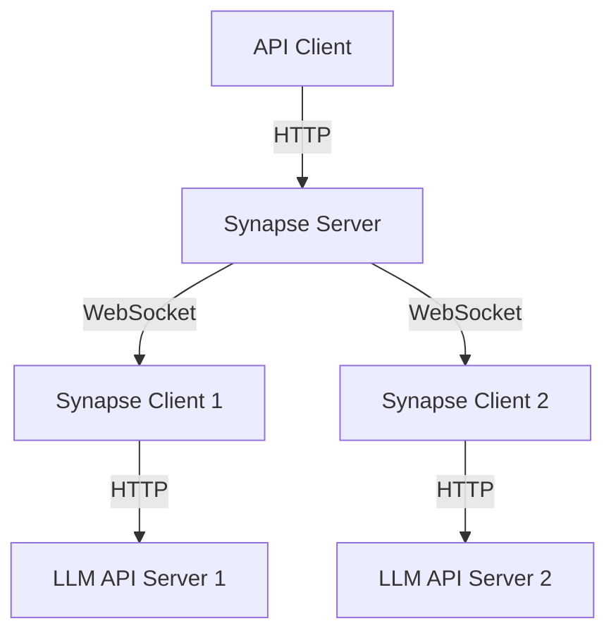

# Synapse

Synapse is a lightweight, efficient reverse proxy system designed to unify access to multiple LLM (Large Language Model) API endpoints. It provides a centralized platform for model discovery and API forwarding, similar to FastChat's worker system but with improvements for local network deployments.

## Changelog

- **2025-11-15**: Added automatic client self-update. When a client reconnects and detects a server version mismatch, it downloads the server-provided client binary and restarts itself with the matching version.

## Features

- **Unified Model Access**: Access multiple OpenAI-compatible API endpoints through a single entry point
- **Dynamic Model Discovery**: Models register themselves with the server dynamically
- **WebSocket Communication**: Clients connect via WebSockets, eliminating the need for public IP addresses
- **Automatic Failover**: Requests are automatically routed to available model instances
- **Load Balancing**: Multiple instances of the same model can be registered for load distribution
- **Model Status Monitoring**: Real-time tracking of model availability
- **Heartbeat Mechanism**: Ensures connections remain active
- **One-Click Client Installation**: Simple script to install and configure the client
- **Version Compatibility Check**: Ensures server and clients are running compatible versions

## Architecture

Synapse consists of two main components:

1. **Synapse Server**: Central endpoint that clients connect to and that receives external API requests
2. **Synapse Client**: Connects to both an upstream LLM API server and the Synapse Server



## Use Cases

Synapse excels in scenarios where:

- Multiple LLM API servers exist in a local network
- You want a unified endpoint for all models
- Some LLM servers lack public IP addresses
- You need to manage multiple instances of the same model
- You want to dynamically add/remove models without reconfiguring clients
- You're running experiments across multiple models and need a consistent interface

Unlike FastChat's worker system (where the OpenAI server needs direct access to the vllm_worker), Synapse uses WebSockets for bidirectional communication. This allows clients to be deployed anywhere only with outbound connections, without requiring inbound connectivity.

## Installation

### Building from Source

```bash
git clone https://github.com/zeyugao/synapse
cd synapse
make all
# or docker
make docker
```

### Docker

```bash
docker pull ghcr.io/zeyugao/synapse:latest
```

## Usage

### Server

```bash
./bin/server [options]
```

Or with docker

```bash
docker run -p 8080:8080 ghcr.io/zeyugao/synapse:latest server [options]
```

Options:
- `--host`: Host to bind the server (default: "localhost")
- `--port`: Port to listen on (default: "8080")
- `--api-auth-key`: API authentication key for securing the API endpoint
- `--ws-auth-key`: WebSocket authentication key for client connections
- `--client-binary`: Path to the client binary for one-click installation (default: "./client")
- `--version`: Print version information


### Client

```bash
./bin/client [options]
```

Options:
- `--server-url`: WebSocket URL of the Synapse server (default: "ws://localhost:8080/ws")
- `--base-url`: Base URL of the upstream OpenAI-compatible API (default: the value in `OPENAI_BASE_URL` environment variable or "http://localhost:8081/v1")
- `--api-key`: API key for the upstream server (default: the value in `OPENAI_API_KEY` environment variable)
- `--ws-auth-key`: WebSocket authentication key (must match server's ws-auth-key)
- `--version`: Print version information

### One-Click Client Installation

Synapse provides a simple installation script you can run on any machine:

```bash
curl http://your-synapse-server/run | bash -s -- --ws-auth-key 'server-ws-auth-key' --base-url "http://127.0.0.1:8081/v1"  --api-key "sk-123456"
```

This will:
1. Download the client binary to `$HOME/.local/bin/synapse-client`
2. Configure it to connect to your server with parameters
3. Start running the client

**Some Notes:**
- The script automatically installs the client to `$HOME/.local/bin/synapse-client`
- The WebSocket URL (`--server-url`) is automatically derived from the server you access the script from
- Version compatibility between client and server is checked automatically
- You can pass additional parameters after `bash -s --` which will be forwarded to the client

## API Usage

Once your setup is running, you can use the Synapse server as a drop-in replacement for OpenAI's API:

```bash
curl http://synapse-server:8080/v1/chat/completions \
  -H "Content-Type: application/json" \
  -H "Authorization: Bearer YOUR_API_KEY" \
  -d '{
    "model": "llama3.1",
    "messages": [{"role": "user", "content": "Hello!"}]
  }'
```

## License

MIT

## Why name synapse

```
Considering that the main functionality of this project is to proxy and load balance AI model requests, it can be named:

"ModelProxy" or "AIModelProxy"

If you want a more creative name, you could consider:

1. "Neuron" - Just like neurons transmit signals in the brain, this program is responsible for forwarding AI model requests.
2. "Synapse" - A neural synapse, responsible for the connection between neurons, perfectly aligns with the functionality of this program.
3. "ModelHub" - Emphasizes its role as a hub for centralized management and distribution of AI models.
4. "AIGateway" - Highlights its role as a gateway for AI services.
5. "ModelMesh" - Suggests its mesh-like structure and service orchestration capabilities.
6. "Nexus" - Indicates its role as a connection point and central hub.

Personally, I recommend "Synapse" as the name because:
1. The name is short and easy to remember.
2. It matches the functional characteristics of the program.
3. It implies its critical connecting role in AI services.
4. It has a technical vibe.
5. It's easy to register domain names and trademarks.

What do you think of these names? Or do you have other ideas?
```
